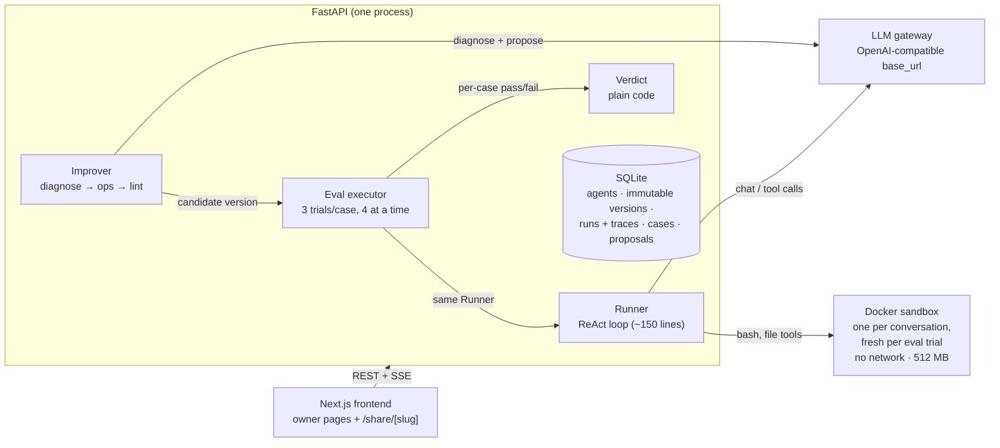

# Agent Provisioning Platform

Create a tool-using agent from a template, share it with a team, collect thumbs-down corrections, turn them into eval cases, and let an improver propose a guideline change. A proposal ships only if a plain-code verdict says it helps without causing regressions.

## Architecture



Request paths:

- **Chat:** `POST /conversations/{id}/messages` starts a background run. The runner loops model → tool → model, emitting step events that the browser reads over SSE (`/runs/{id}/events`). The trace is stored on the run.
- **Evals:** each active case runs 3 times in a fresh sandbox through the same `run_turn`. A case passes when at least 2 of 3 trials pass. A 1–2 split counts as flaky.
- **Improve:** triage failing cases (flaky ones are skipped), diagnose with the improver model, emit at most 3 add/replace/delete ops on the guideline list, lint them, build a candidate version, evaluate it against the base, and compute the verdict.
- **Deploy:** versions never change after creation. Deploying or rolling back moves the agent's `deployed_version_id` pointer.

| Module | Role |
| --- | --- |
| `backend/app/runner.py` | `run_turn`: the agent loop used by chat and evals |
| `backend/app/llm.py` | `LLM` protocol, `OpenAICompatLLM`, `FakeLLM` for tests |
| `backend/app/sandbox.py` | `Sandbox` protocol, `DockerSandbox`, `LocalSandbox` fallback |
| `backend/app/chat_runtime.py` | Sandbox registry per conversation, run tracking, SSE pub/sub (in memory) |
| `backend/app/evals.py` | Eval executor, trial persistence, pass/flaky rules |
| `backend/app/improver.py`, `ops.py`, `lint.py` | Triage, structured ops, op cap, lint, guideline budget |
| `backend/app/verdict.py` | `compute_verdict`: a pure function with no I/O |
| `frontend/app/` | Agents, Studio, chat/share, Evals, Improve, and Versions screens |

## Key decisions

**One runner for chat and evals.** A separate eval harness would drift from production. That happened once during the build: the first eval path didn't copy `orders.csv` into the trial sandbox, so every data case failed for reasons unrelated to the agent. Evals now go through the same `run_turn` and the same file seeding as chat, so what gets tested is what ships.

**The agent loop runs outside the sandbox.** Model calls, API keys, and the database stay in the backend. The sandbox only runs tool commands, has no network, and holds no secrets.

**Versions are immutable.** Several features follow from this rule. Deploying moves a pointer, rollback takes one click, a proposal is just a candidate version, and eval results always refer to a fixed configuration.

**The improver returns structured ops, not a rewritten prompt.** It produces add/replace/delete operations on a list of guideline rules. Each change can be diffed, linted, and capped (3 ops per proposal plus a total guideline budget), and each rule records the case it was added for.

**Plain code wherever possible.** The verdict, the lint, the op cap, and the pass/flaky rules are deterministic and unit-tested. LLMs are used only where judgment is needed: the agent itself, `llm_judge` checks, and the improver.

**Model gateway behind a configurable `base_url`.** Switching providers or pointing at an open-source model only needs a config change. Chat and evals run on `gpt-4o-mini`. Only the improver uses `gpt-4o` (see below).

**A fake model in tests.** The 171-test suite runs offline and gives the same result every time. The real model is used only in the smoke scripts and the end-to-end gate (`scripts/e2e_improve.py`).

### Spending on quality where it matters

With `gpt-4o-mini` as the improver, the end-to-end gate fixed the target case in 2 of 6 runs. Switching only the improver to `gpt-4o` fixed it in 3 of 3 runs. Chat and evals stayed on the cheaper model because they carry most of the traffic. The improver runs rarely and its reasoning was the bottleneck, so that's where the extra cost goes. The full run log is in [`DECISIONS.md`](DECISIONS.md).

## Tradeoffs made for time

Each shortcut sits behind an interface, so replacing one doesn't affect the rest of the system.

| Shortcut | What it costs | The proper version | Why it's acceptable now |
| --- | --- | --- | --- |
| SQLite + in-process background tasks | Durability, write concurrency, more than one worker | Postgres + a job queue | No setup needed, and the path to scale is clear |
| Docker container per conversation | A real security boundary; idle cleanup | A microVM sandbox provider | Free and local, with no signup. A microVM provider (Modal) was tried, hit a persistence blocker, and was rolled back |
| Improver runs inside the HTTP request | About a minute of blocking; no progress updates | Background job + status polling (the UI polling already exists) | One less moving part; fine for a single owner |
| Sandbox registry and event streams kept in memory | A restart loses in-flight runs; no second worker | Shared state store + pub/sub | Keeps a single-process design simple |
| Hand-written loop, no framework | Built-in retries, tracing, and parallel tool calls | A framework once sub-agents are needed | Full control over where events and traces are emitted |
| Studio can't edit guidelines | Rules can't be edited by hand | A text editor (the backend already accepts `guidelines`) | Changes go through proposals, which is the point of the product |
| No auth, CORS open to all origins | Safety with multiple users | Accounts and scoped API keys | One local owner |
| Base eval reuses the latest run for that version | Misses cases added after that run | Record which cases each eval run covered | Cases rarely change within a session |
| Step-level events, no token streaming | Text doesn't appear as it's typed | Token streaming | For an agent, seeing each step matters more |
| Abandoned the full v2 migration | Chat history, cost metering, isolation, signals | Cherry-pick v2 in phases | Each phase needed verification against a real backend. The revert was clean and the branch was kept |

## What breaks first at scale

The single process breaks before the model does. In order:

1. **In-memory state in one process.** Adding a second worker or restarting the server drops running conversations' sandboxes, silences event streams, and leaves containers orphaned. *Fix:* keep run state in the DB or Redis, use shared pub/sub for events, and clean up orphaned sandboxes on startup.
2. **SQLite write contention.** Parallel eval trials raise "database is locked". The one flaky test (`test_concurrency_never_exceeds_4_sandboxes`) fails for exactly this reason. *Fix:* Postgres. Nothing above the storage layer changes.
3. **Containers on one host.** Each conversation keeps a container (512 MB cap) forever because idle cleanup isn't built yet, and cold starts add 1–2 s to the first message. *Fix:* stop idle containers but keep their files, add a global cap, then move to a microVM provider with fast starts.
4. **Eval cost and time.** Cost per proposal is cases × 3 trials × 2 versions. At 100 cases that's 600 agent runs, and LLM rate limits arrive before CPU limits do. *Fix:* cache base-version results, sample large suites, add trials only for flaky cases, and queue requests with backoff.
5. **Improver inside the request.** Proxies cut off minute-long requests, and two owners clicking Improve block each other. *Fix:* a background job plus polling.
6. **Trust, once there are multiple teams.** There's no auth, CORS is open, Docker is the only isolation boundary, and anyone with the link can read every chat on an agent. *Fix:* accounts, per-team isolation, microVM sandboxes, scoped API keys.
7. **Measurement quality.** With a small eval set, one case moves the score by about 14 points, and LLM-judge noise can still get past the 3-trial rule. *Fix:* a benchmark split, creator-supplied ground truth, and reference answers instead of judges where possible.

The interfaces are already in the right places: the `Sandbox` protocol, the `LLM` protocol, a pure-function verdict, and immutable versions. Each fix on this list replaces something behind one of those interfaces without a rewrite.

## Running locally

Requires Python 3.11, Node 20+, and Docker. Without Docker, the backend falls back to `LocalSandbox`, which has no isolation, and the UI shows a warning banner.

```bash
# Sandbox image
docker build -t agentplat-sandbox sandbox/

# Backend
cd backend
python3.11 -m venv .venv && source .venv/bin/activate
pip install -r requirements.txt
cp .env.example .env        # set MODEL_API_KEY
uvicorn app.main:app --port 8000
pytest -q                   # offline, uses FakeLLM

# Frontend
cd frontend
npm install
npm run dev                 # http://localhost:3000
```

Specs live in [`specs/`](specs/), and every deviation from them is logged in [`DECISIONS.md`](DECISIONS.md).
